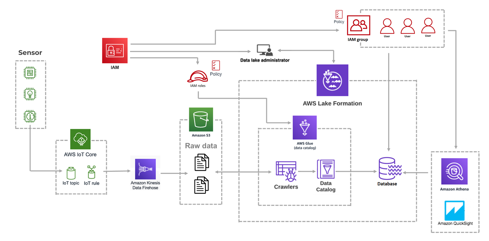

# data-lake-for-smart-farming-system-using-aws-services
Using AWS IoT Core, Amazon S3, AWS Lake Formation, AWS Glue and Amazon Athena to build a demo smart farming system based on Kappa architecture

### Table of Contents
1. [System architecture](#Overall_architecture)
2. [Steps for building Data Lake](#Steps)

# <a name="Overall_architecture"></a> Overall architecture for smart farming system



# <a name="Steps"></a> Steps for building Data Lake using AWS services
## 1. Create bucket
```bash
./create_s3_bucket.sh
```

## 2. Create IoT rule
```bash
./create_IoT_rule.sh
```

## 3. Create delivery stream
```bash
./create_delivery_stream_role.sh
```
```bash
./create_delivery_stream.sh
```
```bash
aws firehose describe-delivery-stream --delivery-stream-name smartfarming_stream
```

## 4. Configure lake formation
```bash
./configure_lake_formation.sh
```

## 5. Create crawler
```bash
./custom_glue_role.sh
```
```bash
./configure_glue_crawler.sh
```

## 6. Send demo data
```bash
cd ./IoT_src
```
```bash
./start.sh
```

## 7. Catalog data
```bash
aws glue start-crawler --name datalake-crawler
```
```bash
aws glue get-tables --database-name datalake-db
```
```bash
cd ..
aws lakeformation grant-permissions --principal '{"DataLakePrincipalIdentifier": "arn:aws:iam::<accountd-id>:user/<username>"}' \
                                    --cli-input-json file://permissions/owner-permissions.json
```

## 8. Query data
Go to Amazon Athena and use the following command to query data
```sql
SELECT * FROM "datalake-db"."data"
```

## 9. Clean system
```bash
./clean_system.sh
```
